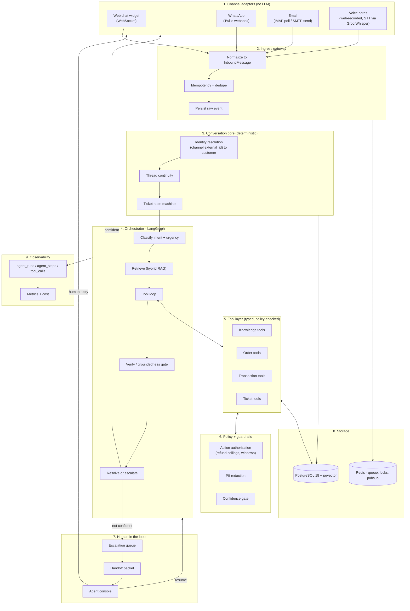

# Agentic AI Customer Support System

An AI support system that reads a customer's problem on any channel, tries to
actually solve it using the company's real order, payment and knowledge data,
and — when it cannot or should not — hands the ticket to a human with a full
context packet instead of a shrug.

Runs entirely on a laptop. No paid services.

## What makes it "agentic"

Not "an LLM with a chat window". The system:

- **Plans** — classifies intent, picks a tool group, decides whether it needs to
  retrieve knowledge or query the business database.
- **Acts** — calls typed tools against real order, shipment and transaction data,
  in a bounded loop, recovering from tool errors.
- **Verifies** — checks its own draft for groundedness, policy safety and
  completeness before anything reaches a customer.
- **Knows its limits** — refuses to act beyond authorization ceilings, escalates
  on low confidence, knowledge gaps, policy limits, abuse or legal risk.
- **Hands off well** — produces a summary, a timeline, the entities it verified,
  what it could not do, and a suggested reply and action.
- **Resumes** — the human can return the ticket to the AI with a note, and the
  agent continues from its checkpointed state.

## Architecture in one paragraph

Channel adapters (web chat, WhatsApp, email, later voice) contain no LLM; they
normalize provider payloads into one canonical `InboundMessage` and render
replies back. An ingress gateway dedupes and persists, acknowledges the webhook,
then enqueues the work. A worker runs a single channel-agnostic LangGraph state
machine: prepare, classify, hard-route, plan, retrieve (hybrid RAG over
pgvector + Postgres full-text), act (bounded tool loop behind a policy layer),
verify, then respond or escalate. Escalation pauses the graph at a checkpoint,
writes a handoff packet to a priority queue, and a human agent picks it up in a
console — replying through the same channel the customer used, or handing control
back to the AI. Everything is one PostgreSQL database, and every run, step and tool call is
recorded for the dashboard and the evaluation harness.

Full detail: [`docs/01-architecture.md`](docs/01-architecture.md).



## Documentation

| Document | Contents |
|---|---|
| [`docs/00-plan-review.md`](docs/00-plan-review.md) | What was wrong with the first draft design and why the current one differs |
| [`docs/01-architecture.md`](docs/01-architecture.md) | Layers, diagrams, request and escalation lifecycles, process topology |
| [`docs/02-tech-stack.md`](docs/02-tech-stack.md) | Every dependency and the reason for it; repository layout |
| [`docs/03-data-model.md`](docs/03-data-model.md) | Full schema with SQL, state machine, seed data plan |
| [`docs/04-agent-design.md`](docs/04-agent-design.md) | Graph state, node by node, tool catalog, prompting, failure handling |
| [`docs/05-escalation-policy.md`](docs/05-escalation-policy.md) | Trigger table, authorization matrix, handoff packet, resume mechanics |
| [`docs/06-api-spec.md`](docs/06-api-spec.md) | REST and WebSocket surface |
| [`docs/07-build-stages.md`](docs/07-build-stages.md) | 12-week plan, definitions of done, demo scripts, cut list |
| [`docs/08-evaluation.md`](docs/08-evaluation.md) | Golden dataset, metrics, judging, ablations |
| [`docs/09-risks.md`](docs/09-risks.md) | Failure modes and mitigations |

## Stack

Python 3.13 · FastAPI 0.141 · LangGraph 1.2 · PostgreSQL 18 + pgvector 0.8.6 ·
Redis + arq · SQLAlchemy 2.0 + Alembic · Vite + React 19 + TanStack Router/Query
+ Tailwind · `gemini-3.8-flash` primary with Groq `openai/gpt-oss-120b`
fallback · local `bge-small-en-v1.5` embeddings via fastembed ·
Twilio WhatsApp sandbox · Gmail IMAP/SMTP · Recharts for the metrics dashboard ·
voice notes transcribed via Groq's hosted `whisper-large-v3`
(`docs/decisions/0005-voice-stt-groq-fallback.md` explains why not a local
model, given this build machine's measured RAM/GPU constraints).

Versions verified 8 September 2026. Notably **not** used: `gemini-2.5-*`
(a generation behind, and `gemini-2.0-flash` is shut down), Groq
`llama-3.3-70b-versatile` (deprecated 16 Aug 2026), and Next.js — the backend is
FastAPI, so a Node server that only renders a shell is dead weight. Reasoning in
[`docs/02-tech-stack.md`](docs/02-tech-stack.md).

## Quick start

```bash
cp .env.example .env          # add GEMINI_API_KEY and/or GROQ_API_KEY
make up                       # postgres + redis
make migrate                  # alembic upgrade head
make seed                     # synthetic customers, orders, transactions, KB
make dev                      # api + worker + scheduler + frontend
```

Or, to reproduce the Stage 6 demo script end to end in one command (resets the
database, seeds and ingests fresh, starts everything, and runs the automated
half of the scenario against the running stack):

```bash
make demo
```

- Customer web chat: http://localhost:5173/chat
- Agent console (sign in, any seeded agent, password `dev-password`):
  http://localhost:5173/login
- Admin dashboard (tickets, reasoning trace, metrics, knowledge base — admin
  role only for writes): http://localhost:5173/admin
- API docs: http://localhost:8000/docs

No API key? Set `LLM_PROVIDER=stub` for a deterministic fake model — the whole
pipeline runs offline for tests, for developing the UI, and for the Stage 12
concurrency check.

## Trying voice for real

The web chat widget has a microphone button (`useVoiceRecorder`,
`app/channels/voice.py`) that records a short clip, uploads it to
`POST /channels/voice/upload`, transcribes it via Groq's hosted Whisper, and
runs the transcript through the exact same pipeline every other channel
uses — the orchestrator needed zero changes for voice (see
`docs/PROGRESS.md` Stage 10). WhatsApp voice notes are transcribed the same
way, automatically, no setup needed beyond `GROQ_API_KEY`.

To try the web widget's recording button:

1. Set `VOICE_ENABLED=true` in `.env` (default `false`, same opt-in pattern
   as email) and make sure `GROQ_API_KEY` is set.
2. Open http://localhost:5173/chat, allow microphone access, and hold the
   🎤 button to record a question like "what's the status of my order".
3. The transcript appears as your message; the reply comes back short and
   plain (no markdown, no links) via `ResponseStyle`, same as WhatsApp.

## Trying WhatsApp for real

The WhatsApp adapter, webhook, signature verification, and delivery-status
tracking are all built and covered by tests using a real (but offline) Twilio
signature check — see `backend/tests/test_whatsapp.py`. Every code path is
also exercised without Twilio at all via `POST /dev/simulate/whatsapp`
(same shape as `/dev/simulate/web`).

Proving it against an actual phone needs a few manual steps that only make
sense with you actively driving your phone, so they're not automated:

1. Create a free [Twilio](https://www.twilio.com/try-twilio) account, open the
   [WhatsApp Sandbox](https://console.twilio.com/us1/develop/sms/try-it-out/whatsapp-learn),
   and note the sandbox number and join code.
2. From your phone, WhatsApp the join code to the sandbox number.
3. Put your Account SID and Auth Token into `.env`
   (`TWILIO_ACCOUNT_SID`, `TWILIO_AUTH_TOKEN`).
4. Start a public tunnel to this machine, e.g. `cloudflared tunnel --url
   http://localhost:8000`, and put the resulting URL into `.env` as
   `PUBLIC_BASE_URL` (no trailing slash) — this is also what
   `X-Twilio-Signature` verification checks the request against, so it must
   match exactly.
5. In the Twilio console, set the sandbox's "when a message comes in" webhook
   to `<PUBLIC_BASE_URL>/channels/whatsapp/webhook` and the status callback
   to `<PUBLIC_BASE_URL>/channels/whatsapp/status`.
6. Message the sandbox number from your phone. `make dev`'s worker log shows
   the run; the reply arrives back on WhatsApp.

Twilio's trial credit is small (~100 WhatsApp messages) - budget it for this
test and for a demo, not for development, which the simulator already covers.

## Trying email for real

Same story as WhatsApp: the IMAP poller (an arq cron job, `app/workers/
email_poll.py`), MIME/quoted-text parsing, Message-ID/References threading,
loop protection (ignores mailing lists and auto-replies), and SMTP send are
all built and unit-tested (`backend/tests/test_email_parsing.py`,
`test_email_adapter.py`) without needing a mailbox. `POST
/dev/simulate/email` exercises the same ingest path the real poller does.

To try it against a real inbox:

1. Create a dedicated, throwaway Gmail address - never a personal one.
2. Turn on 2-Step Verification, then create an
   [App Password](https://myaccount.google.com/apppasswords).
3. In `.env`, set `EMAIL_ENABLED=true`, `SUPPORT_EMAIL` to the address, and
   `SUPPORT_EMAIL_APP_PASSWORD` to the app password.
4. `make dev` - the cron job polls every 30s. Email the address and watch
   the worker log; the reply arrives in the same thread.

No tunnel needed here - IMAP polling reaches out, nothing needs to reach in.

## Scope

**This is a prototype: stop polishing early, do not skip structure.** Rare
edge-case bugs are acceptable and not worth chasing — a stray email signature in a
transcript, a race needing three simultaneous messages, rough unstyled UI. The
queue, the migrations, the dedupe constraint, the audit and trace tables, the
escalation loop and the evaluation harness all stay, because each either *is* the
project or prevents a failure that ruins a demo.

What is genuinely out of scope — skill-based assignment routing, SLA cron,
reranking, a trace UI, CI, mypy, real load testing — is listed in
[`docs/07-build-stages.md`](docs/07-build-stages.md#deliberately-not-doing) so it
reads as a trade-off rather than an oversight.

## Project status

Stages 0-11 built and tested; Stage 12 (hardening, demo, writeup) in
progress. See [`docs/07-build-stages.md`](docs/07-build-stages.md) for the
stage checklists and [`docs/PROGRESS.md`](docs/PROGRESS.md) for what is
actually built, stage by stage, including real bugs found and fixed along
the way — including several found live, not in a unit test: a
`MissingGreenlet` on an `onupdate`-expired column (Stage 9), a stale
editable install silently breaking `pytest` after a dependency change
(Stage 10), and PII redaction (`messages.body_redacted`) turning out to be
schema-only with no actual redaction path anywhere until Stage 12's PII
check caught it.

**Stage 6 is the milestone**: a complete vertical slice with escalation and
the human console. Stage 11 (the evaluation harness, `eval/run_eval.py`,
50 hand-labelled cases) is the other one — it's what turns "the AI resolves
customer issues" from a claim into a measurable result. A full run across
every ablation is one `make eval --all-ablations --sweep-confidence` away
once there's LLM quota headroom to spend on it; see `docs/PROGRESS.md`
Stage 11 for why it wasn't run to completion during development (both
`gemini-3.8-flash`'s 20-requests/day free tier and a live API slowdown, not
a harness limitation).
