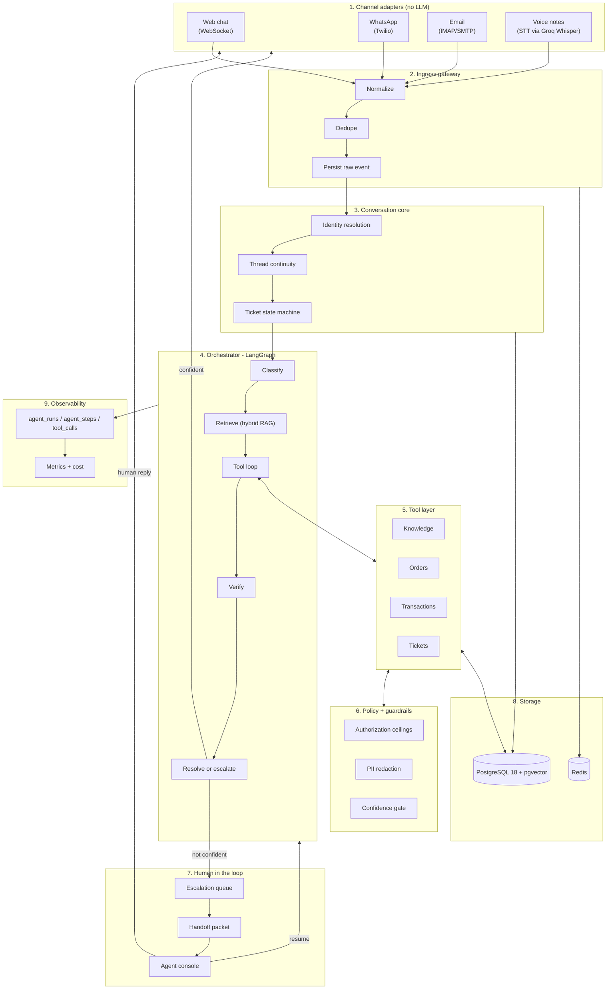

# Agentic AI Customer Support System


An AI support system that reads a customer's problem on any channel, tries to
resolve it against real order/payment/knowledge data, and hands off to a
human with full context when it can't or shouldn't. Runs entirely on a
laptop, no paid services required.

## What it does

- **Plans** — classifies intent, picks a tool group, decides whether to retrieve knowledge or query business data
- **Acts** — calls typed tools against real order/shipment/transaction data, in a bounded loop
- **Verifies** — checks its own draft for groundedness, policy safety and completeness before it reaches a customer
- **Knows its limits** — refuses beyond authorization ceilings, escalates on low confidence / knowledge gaps / policy limits
- **Hands off well** — summary, timeline, verified entities, suggested reply, full context packet for the human agent
- **Resumes** — a human can return a ticket to the AI with a note; it continues from its checkpoint

## Architecture

Channel adapters (web, WhatsApp, email, voice) carry **no LLM logic** — they normalize provider payloads to one `InboundMessage`/`OutboundMessage` pair. One channel-agnostic LangGraph state machine does all reasoning. Full detail: [`docs/01-architecture.md`](docs/01-architecture.md).


```mermaid
flowchart TB
    subgraph CH["1. Channel adapters (no LLM)"]
        W["Web chat<br/>(WebSocket)"]
        WA["WhatsApp<br/>(Twilio)"]
        EM["Email<br/>(IMAP/SMTP)"]
        VO["Voice notes<br/>(STT via Groq Whisper)"]
    end

    subgraph GW["2. Ingress gateway"]
        NORM["Normalize"]
        DEDUP["Dedupe"]
        RAW["Persist raw event"]
    end

    subgraph CORE["3. Conversation core"]
        IDENT["Identity resolution"]
        THREAD["Thread continuity"]
        TSM["Ticket state machine"]
    end

    subgraph ORCH["4. Orchestrator - LangGraph"]
        CLS["Classify"]
        RET["Retrieve (hybrid RAG)"]
        ACT["Tool loop"]
        VER["Verify"]
        DEC["Resolve or escalate"]
    end

    subgraph TOOLS["5. Tool layer"]
        KB["Knowledge"]
        ORD["Orders"]
        TXN["Transactions"]
        TKT["Tickets"]
    end

    subgraph POL["6. Policy + guardrails"]
        AUTH["Authorization ceilings"]
        PII["PII redaction"]
        CONF["Confidence gate"]
    end

    subgraph HIL["7. Human in the loop"]
        Q["Escalation queue"]
        PKT["Handoff packet"]
        CON["Agent console"]
    end

    subgraph DATA["8. Storage"]
        PG[("PostgreSQL 18 + pgvector")]
        RD[("Redis")]
    end

    subgraph OBS["9. Observability"]
        TR["agent_runs / agent_steps / tool_calls"]
        MET["Metrics + cost"]
    end

    W --> NORM
    WA --> NORM
    EM --> NORM
    VO --> NORM
    NORM --> DEDUP --> RAW --> IDENT --> THREAD --> TSM --> CLS
    CLS --> RET --> ACT --> VER --> DEC
    ACT <--> TOOLS
    TOOLS <--> POL
    TOOLS <--> PG
    DEC -->|confident| CH
    DEC -->|not confident| Q
    Q --> PKT --> CON
    CON -->|human reply| CH
    CON -->|resume| ORCH
    ORCH --> TR
    CORE --> PG
    GW --> RD
    TR --> MET
```

## Stack

| Layer | Choice |
|---|---|
| Backend | Python 3.13, FastAPI, async SQLAlchemy 2.0 + Alembic (asyncpg) |
| Agent orchestration | LangGraph, checkpointed via `langgraph-checkpoint-postgres` (psycopg 3) |
| LLM — primary | Gemini `gemini-3.5-flash-lite` (classify / reason / verify / summarize) |
| LLM — fallback | Groq `openai/gpt-oss-20b` / `openai/gpt-oss-120b` |
| LLM — eval judge | Groq `openai/gpt-oss-120b` (deliberately a different provider than the system under test) |
| Embeddings | Local `bge-small-en-v1.5` via fastembed, no key needed |
| Database | PostgreSQL 18 + pgvector 0.8.6 (hybrid vector + full-text retrieval) |
| Queue / jobs | Redis + `arq` worker + scheduler |
| Frontend | Vite + React 19 + TanStack Router/Query + Tailwind |
| Channels | Web (WebSocket), WhatsApp (Twilio sandbox), Email (Gmail IMAP/SMTP), Voice (Groq Whisper STT) |

Model ids live only in `.env`, read through `app/llm/registry.py` — see [`docs/02-tech-stack.md`](docs/02-tech-stack.md) for the full reasoning.

## Quick start

```bash
cp .env.example .env          # add GEMINI_API_KEY and/or GROQ_API_KEY
make up                       # postgres + redis
make migrate                  # alembic upgrade head
make seed                     # synthetic customers, orders, transactions, KB
make dev                      # api + worker + frontend
```

One-command scripted demo (reset, seed, ingest, run the demo scenario):

```bash
make demo
```

| URL | What |
|---|---|
| http://localhost:5173/chat | Customer web chat (email login, past tickets) |
| http://localhost:5173/login | Agent console / admin login (any seeded agent, password `dev-password`) |
| http://localhost:5173/console | Escalation queue + human handoff |
| http://localhost:5173/admin | Tickets, reasoning trace, metrics, knowledge base |
| http://localhost:8000/docs | API docs |

Set `LLM_PROVIDER=stub` for a deterministic offline fake model — no API key needed, used for UI work and tests.

## Enabling real channels

All channels are simulator-testable with zero setup (`POST /dev/simulate/*`). Going through a real provider needs a bit more:

| Channel | Enable | Extra setup |
|---|---|---|
| Web chat | on by default | none |
| Voice notes | `VOICE_ENABLED=true` + `GROQ_API_KEY` | mic permission in browser |
| WhatsApp | `TWILIO_ACCOUNT_SID` / `TWILIO_AUTH_TOKEN` in `.env` | free Twilio sandbox + a public tunnel (e.g. `cloudflared`) pointed at `/channels/whatsapp/webhook` |
| Email | `EMAIL_ENABLED=true`, `SUPPORT_EMAIL`, `SUPPORT_EMAIL_APP_PASSWORD` | dedicated Gmail address + app password (2FA required), polled every 30s, no tunnel needed |

## Scope

Prototype: infrastructure that prevents a class of bug is kept; polish that doesn't affect correctness is skipped. Full reasoning: [`docs/decisions/0003-prototype-scope.md`](docs/decisions/0003-prototype-scope.md).

| Kept (non-negotiable) | Skipped (deliberately) |
|---|---|
| `arq` worker + scheduler, Alembic migrations | Skill-based routing algorithm (column exists, no logic) |
| `raw_events`, `refunds`, `shipments`, `agent_steps`, `tool_calls` as real tables | SLA breach cron |
| PII redaction into `messages.body_redacted` | Reranking |
| Escalation loop, handoff packet, `verify` node | Trace UI, CI, mypy, coverage gates |
| ~40 tests on critical paths (ticket transitions, dedupe, identity, `authorize()`, tool scoping, PII, retrieval) | Real load testing, RFC-7807 errors, cursor pagination |

## Documentation

| Document | Contents |
|---|---|
| [`docs/01-architecture.md`](docs/01-architecture.md) | Layers, diagrams, request/escalation lifecycles |
| [`docs/02-tech-stack.md`](docs/02-tech-stack.md) | Every dependency and why, repo layout |
| [`docs/03-data-model.md`](docs/03-data-model.md) | Full schema, state machine, seed data |
| [`docs/04-agent-design.md`](docs/04-agent-design.md) | Graph state, nodes, tool catalog, prompting |
| [`docs/05-escalation-policy.md`](docs/05-escalation-policy.md) | Trigger table, authorization matrix, handoff packet |
| [`docs/06-api-spec.md`](docs/06-api-spec.md) | REST and WebSocket surface |
| [`docs/07-build-stages.md`](docs/07-build-stages.md) | Build plan, definitions of done, cut list |
| [`docs/08-evaluation.md`](docs/08-evaluation.md) | Golden dataset, metrics, judging, ablations |
| [`docs/09-risks.md`](docs/09-risks.md) | Failure modes and mitigations |
| [`docs/PROGRESS.md`](docs/PROGRESS.md) | Build log, stage by stage |
| [`docs/REPORT.md`](docs/REPORT.md) | Final writeup |
| [`docs/decisions/`](docs/decisions/) | One file per non-obvious decision |

## License

[MIT](LICENSE)
