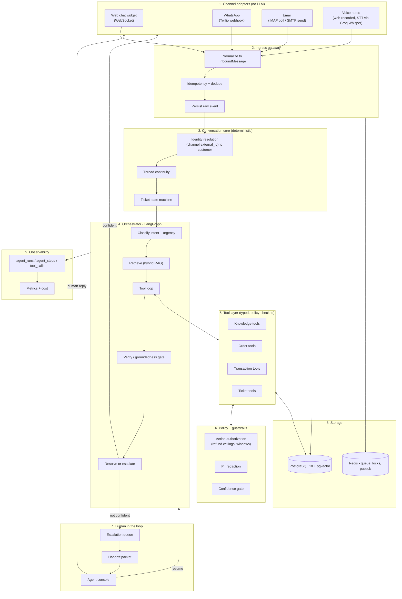
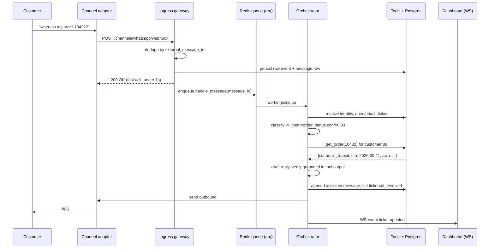
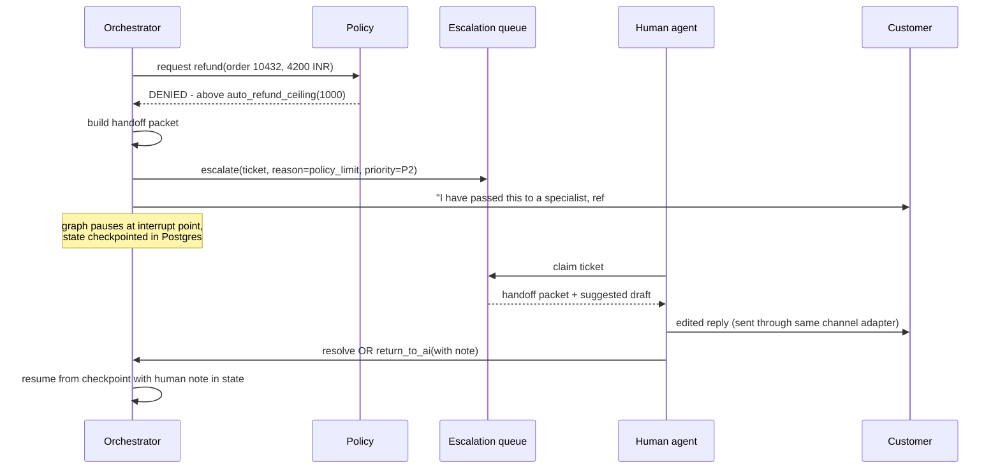

# Architecture

## Design principles

1. **One brain, many mouths.** Reasoning is channel-agnostic. Channels are
   adapters that normalize in and render out.
2. **Agents propose, code disposes.** The LLM chooses which tool to call and what
   to say. It never writes to a business table directly and never bypasses a
   policy check. Every side effect goes through a validated service function.
3. **Deterministic where possible.** Ticket state machine, identity resolution,
   idempotency, escalation thresholds and authorization limits are ordinary code.
   The LLM is used only for language and judgement.
4. **Escalation is a feature, not a failure.** A correct handoff with good
   context is a successful outcome, and is measured as one.
5. **Everything is observable.** Every run, step, tool call, token count and
   latency is persisted. If it is not in a table you cannot grade it.
6. **Local-first.** The whole system runs from `docker compose up` with no paid
   service. External providers (Twilio sandbox, Gmail) are optional adapters that
   can be swapped for a simulator.
7. **Prototype tolerance, not prototype infrastructure.** Rare edge-case bugs are
   acceptable and not worth chasing; the demo path and the escalation loop are
   not. That is a licence to stop polishing, not a licence to skip the
   infrastructure that keeps the system honest — the queue, the migrations, the
   audit tables and the eval harness all stay.

## Layer diagram



## Request lifecycle (happy path)



## Escalation lifecycle



## Component responsibilities

### 1. Channel adapters
Contain **zero** business logic and **zero** LLM calls. Each implements the same
two-function interface:

```python
class ChannelAdapter(Protocol):
    channel: Channel                                  # enum
    async def parse(self, payload: dict) -> InboundMessage: ...
    async def send(self, reply: OutboundMessage) -> DeliveryReceipt: ...
    def style(self) -> ResponseStyle: ...             # length, format, latency budget
```

`InboundMessage` is the single canonical shape everything downstream sees:

```python
class InboundMessage(BaseModel):
    channel: Channel                 # web | whatsapp | email | voice
    external_thread_id: str          # phone number, email thread id, session id
    external_message_id: str         # used for dedupe
    sender: SenderRef                # {kind: phone|email|session, value: str}
    text: str                        # plain text, already extracted from HTML/audio
    subject: str | None = None
    attachments: list[Attachment] = []
    received_at: datetime
    raw: dict                        # the untouched provider payload
```

### 2. Ingress gateway
- Verifies provider signature (Twilio `X-Twilio-Signature`).
- Rejects duplicates: `INSERT ... ON CONFLICT DO NOTHING` on
  `(channel, external_message_id)`; if the insert affected 0 rows, drop the event.
  This one constraint is the difference between one reply and three.
- Persists the raw payload before anything else, so a crash never loses a
  customer message.
- **Acknowledges immediately** and hands the work to the queue. Never make a
  provider webhook wait for an LLM.

### 3. Conversation core
- **Identity resolution:** look up `customer_identities(channel, external_id)`.
  On miss, create a provisional customer marked `unverified` and add a
  verification step to the graph before any account-specific tool is allowed.
- **Thread continuity:** map the external thread to an open `conversation`. A new
  conversation starts after an idle window (default 24h) or an explicit close.
- **Ticket state machine** (transitions validated in `core/tickets.py`):

```
new -> ai_working -> ai_resolved -> closed
                  -> awaiting_customer -> ai_working
                  -> escalated -> human_working -> human_resolved -> closed
                                               -> ai_working  (returned to AI)
any -> closed (timeout / customer abandon)
```

### 4. Orchestrator
A LangGraph `StateGraph` with a checkpointer backed by Postgres. Checkpointing is
what makes human-in-the-loop clean: the graph pauses on an `interrupt`, the state
sits in a table, and it resumes days later on the same state. Detailed in
`04-agent-design.md`.

### 5. Tool layer
Plain async Python functions with Pydantic argument models, registered into a
catalog. Rules:
- Every tool takes an explicit `customer_id` from **trusted state**, never from
  the model's output — this prevents the model from being talked into reading
  another customer's order.
- Read tools are free to call. Write tools go through the policy layer.
- Every call is recorded in `tool_calls` with arguments, result, latency, error.

### 6. Policy and guardrails
- `authorize(action, actor, context) -> Allow | RequireHuman | Deny` with reasons.
- PII redaction on the way into a prompt, restoration on the way out.
- Confidence gate combining retrieval score, self-check verdict, tool success and
  turn count. Thresholds live in one config file so they can be tuned and shown
  in the report.

### 7. Human in the loop
Queue in Postgres (ordered by priority then age), claimed atomically with
`SELECT ... FOR UPDATE SKIP LOCKED`. The console shows the handoff packet, the
full transcript, the linked order/transaction records, and an editable AI draft.
Sending goes through the same adapter the customer used, so the customer sees one
continuous thread.

### 8. Storage
One PostgreSQL 18 with `pgvector` 0.8.6 — vector search is still an extension, not
in PG core, despite what several 2026 blog posts claim. Redis for the job queue,
per-conversation locks and dashboard pub/sub. Nothing else.

### 9. Observability
`agent_runs` (one per inbound message), `agent_steps` (one per node execution) and
`tool_calls`, with token counts and estimated cost. The dashboard and the eval
harness read them directly; there is no separate analytics store. This is the
highest-value-per-line part of the codebase — the "why did the AI do that" screen
and half the eval metrics come straight out of these three tables.

## Process topology

Three processes, all in `docker compose`:

| Process | Role |
|---|---|
| `api` (uvicorn) | HTTP + WebSocket. Webhooks, dashboard API, console API. Never runs an LLM inline. |
| `worker` (arq) | Consumes the queue, runs the orchestrator graph, sends outbound messages. |
| `scheduler` (arq cron) | IMAP polling, stale-ticket sweeps. |

Plus `postgres` and `redis`. The frontend is static files, served by FastAPI in
production and by Vite's dev server in development.

## Why a queue

Three things here are slow or unreliable and must not block a webhook: LLM calls
(1-10s, on rate-limited free tiers), IMAP/SMTP, and retries. The queue also gives
retry-with-backoff for free, which is the difference between "the free tier 429'd
and the customer got nothing" and "the reply arrived twenty seconds late". On a
free tier the second case is common, so this is not hypothetical.

Two messages arriving for the same conversation at once are serialised by a Redis
lock keyed on `conversation_id`; the second run re-reads history so it sees the
first reply.

## What "prototype" means here

**Stop polishing early. Do not skip structure.**

Acceptable — do not spend time on these:

- Rare edge-case bugs. An odd email signature left in a transcript, a race that
  needs three simultaneous messages to trigger, a metric off by one on a boundary.
- Imperfect quoted-text stripping in email.
- Rough UI: unstyled states, no empty-state illustrations, no animations.
- No horizontal scale, no HA, no multi-tenancy, no rate limiting beyond a
  per-sender email guard.
- Thin test coverage outside the critical paths named in `07-build-stages.md`.

Not acceptable — these stay, because each either *is* the project or prevents a
class of failure that ruins a demo:

- The queue, the migrations, the dedupe constraint, the audit and trace tables.
- The escalation loop, the handoff packet, the `verify` node.
- Policy authorization in code, and `customer_id` from trusted state.
- The evaluation harness.

Genuinely skipped, as scope rather than shortcuts: skill-based assignment
routing, SLA breach cron, reranking, a self-hosted trace UI, RFC-7807 error
bodies, cursor pagination, CI, and mypy.
