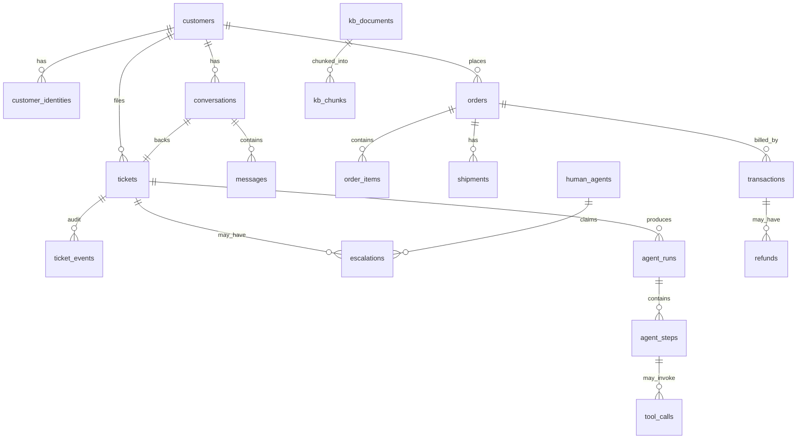

# Data Model

One PostgreSQL 18 database, managed with Alembic. All timestamps are
`timestamptz`; all ids are `bigserial` except tickets, which also carry a
human-readable `reference`.



## Group A — Support core

```sql
CREATE TABLE customers (
    id         bigserial PRIMARY KEY,
    full_name  text,
    email      citext UNIQUE,
    phone      text UNIQUE,
    tier       text NOT NULL DEFAULT 'standard',   -- standard | plus | priority
    locale     text NOT NULL DEFAULT 'en-IN',
    verified   boolean NOT NULL DEFAULT false,
    created_at timestamptz NOT NULL DEFAULT now()
);

-- Identity resolution. A phone number or email address is not a customer id.
CREATE TABLE customer_identities (
    id          bigserial PRIMARY KEY,
    customer_id bigint NOT NULL REFERENCES customers(id) ON DELETE CASCADE,
    channel     text NOT NULL,        -- web | whatsapp | email | voice
    external_id text NOT NULL,        -- +9198..., alice@x.com, session uuid
    verified_at timestamptz,
    UNIQUE (channel, external_id)
);

CREATE TABLE conversations (
    id                 bigserial PRIMARY KEY,
    customer_id        bigint NOT NULL REFERENCES customers(id),
    channel            text NOT NULL,
    external_thread_id text NOT NULL,
    status             text NOT NULL DEFAULT 'open',   -- open | idle | closed
    started_at         timestamptz NOT NULL DEFAULT now(),
    last_message_at    timestamptz NOT NULL DEFAULT now(),
    closed_at          timestamptz
);
CREATE INDEX ON conversations (channel, external_thread_id, status);

CREATE TABLE messages (
    id                  bigserial PRIMARY KEY,
    conversation_id     bigint NOT NULL REFERENCES conversations(id) ON DELETE CASCADE,
    role                text NOT NULL,   -- customer | assistant | human_agent | system
    author_agent_id     bigint REFERENCES human_agents(id),
    body                text NOT NULL,
    body_redacted       text,            -- PII-scrubbed copy; this is what the LLM sees
    channel             text NOT NULL,
    direction           text NOT NULL,   -- inbound | outbound
    external_message_id text,
    attachments         jsonb NOT NULL DEFAULT '[]',
    delivery_status     text,            -- queued | sent | delivered | failed
    created_at          timestamptz NOT NULL DEFAULT now(),
    UNIQUE (channel, external_message_id)   -- the dedupe guarantee
);
CREATE INDEX ON messages (conversation_id, created_at);

-- Raw provider payloads, written before anything else touches the message.
-- With a queue in front of the orchestrator, this is what guarantees a crash
-- between "webhook received" and "job ran" never loses a customer message.
CREATE TABLE raw_events (
    id           bigserial PRIMARY KEY,
    channel      text NOT NULL,
    payload      jsonb NOT NULL,
    signature_ok boolean,
    processed    boolean NOT NULL DEFAULT false,
    error        text,
    received_at  timestamptz NOT NULL DEFAULT now()
);

CREATE TABLE tickets (
    id                 bigserial PRIMARY KEY,
    reference          text UNIQUE NOT NULL,        -- 'T-1041'
    customer_id        bigint NOT NULL REFERENCES customers(id),
    conversation_id    bigint REFERENCES conversations(id),
    channel            text NOT NULL,
    subject            text,
    intent             text,
    status             text NOT NULL DEFAULT 'new',
    priority           text NOT NULL DEFAULT 'P3',  -- P1..P4
    sentiment          text,
    ai_turns           int NOT NULL DEFAULT 0,
    resolution         text,        -- ai_resolved | human_resolved | abandoned
    resolution_summary text,
    csat               int,         -- 1..5, optional
    first_response_at  timestamptz,
    resolved_at        timestamptz,
    created_at         timestamptz NOT NULL DEFAULT now(),
    updated_at         timestamptz NOT NULL DEFAULT now()
);
CREATE INDEX ON tickets (status, priority, created_at);

-- Append-only audit. Every transition, every actor.
CREATE TABLE ticket_events (
    id          bigserial PRIMARY KEY,
    ticket_id   bigint NOT NULL REFERENCES tickets(id) ON DELETE CASCADE,
    event_type  text NOT NULL,   -- created | status_changed | assigned | escalated |
                                 -- tool_executed | reply_sent | note_added | resolved
    actor_type  text NOT NULL,   -- system | ai | human | customer
    actor_id    text,
    from_status text,
    to_status   text,
    payload     jsonb NOT NULL DEFAULT '{}',
    created_at  timestamptz NOT NULL DEFAULT now()
);
```

### Ticket status values

`new`, `ai_working`, `awaiting_customer`, `ai_resolved`, `escalated`,
`human_working`, `human_resolved`, `closed`, `reopened`.

Transitions are validated in `core/tickets.py`; an invalid transition raises
rather than silently writing.

## Group B — Commerce

Synthetic, but realistic enough that the agents have something non-trivial to
reason about.

```sql
CREATE TABLE orders (
    id                 bigserial PRIMARY KEY,
    order_number       text UNIQUE NOT NULL,       -- 'ORD-10432'
    customer_id        bigint NOT NULL REFERENCES customers(id),
    status             text NOT NULL,   -- placed|confirmed|packed|shipped|in_transit|
                                        -- out_for_delivery|delivered|cancelled|returned
    total_amount       numeric(12,2) NOT NULL,
    currency           text NOT NULL DEFAULT 'INR',
    placed_at          timestamptz NOT NULL,
    promised_delivery  date,
    delivered_at       timestamptz,
    cancellable_until  timestamptz,     -- policy input, NOT an LLM judgement
    return_window_ends date,            -- policy input, NOT an LLM judgement
    shipping_address   jsonb NOT NULL
);

CREATE TABLE order_items (
    id         bigserial PRIMARY KEY,
    order_id   bigint NOT NULL REFERENCES orders(id) ON DELETE CASCADE,
    sku        text NOT NULL,
    name       text NOT NULL,
    qty        int NOT NULL,
    unit_price numeric(12,2) NOT NULL,
    returnable boolean NOT NULL DEFAULT true
);

CREATE TABLE shipments (
    id            bigserial PRIMARY KEY,
    order_id      bigint NOT NULL REFERENCES orders(id) ON DELETE CASCADE,
    carrier       text NOT NULL,
    tracking_no   text NOT NULL,
    status        text NOT NULL,
    last_scan_at  timestamptz,
    last_location text,
    eta           date,
    events        jsonb NOT NULL DEFAULT '[]'   -- scan history, drives "where is it"
);

CREATE TABLE transactions (
    id           bigserial PRIMARY KEY,
    txn_ref      text UNIQUE NOT NULL,           -- 'TXN-88213'
    order_id     bigint REFERENCES orders(id),
    customer_id  bigint NOT NULL REFERENCES customers(id),
    type         text NOT NULL,   -- payment | refund | chargeback | adjustment
    method       text NOT NULL,   -- card | upi | netbanking | wallet | cod
    amount       numeric(12,2) NOT NULL,
    currency     text NOT NULL DEFAULT 'INR',
    status       text NOT NULL,   -- pending | authorized | captured | failed |
                                  -- refund_initiated | refunded | reversed
    gateway_ref  text,
    failure_code text,
    created_at   timestamptz NOT NULL,
    settled_at   timestamptz
);

-- Separate from transactions because a refund has an approval lifecycle a
-- payment does not, and that lifecycle is the most demo-critical write path in
-- the system: AI requests -> policy denies -> human approves -> processed.
CREATE TABLE refunds (
    id                bigserial PRIMARY KEY,
    transaction_id    bigint NOT NULL REFERENCES transactions(id),
    ticket_id         bigint REFERENCES tickets(id),
    amount            numeric(12,2) NOT NULL,
    reason            text NOT NULL,
    status            text NOT NULL,  -- requested | approved | rejected | processing | completed
    requested_by_type text NOT NULL,  -- ai | human
    requested_by_id   text,
    approved_by       bigint REFERENCES human_agents(id),
    expected_credit_by date,
    created_at        timestamptz NOT NULL DEFAULT now()
);
```

`cancellable_until`, `return_window_ends` and `order_items.returnable` are the
most valuable columns in the schema. Eligibility is **read**, never inferred by
the model. That one choice removes most of the hallucination risk for
approximately zero effort.

## Group C — Knowledge base and retrieval

```sql
CREATE EXTENSION IF NOT EXISTS vector;

CREATE TABLE kb_documents (
    id         bigserial PRIMARY KEY,
    title      text NOT NULL,
    source     text NOT NULL,     -- faq | policy | macro | manual
    category   text,              -- shipping | refunds | payments | account | product
    body       text NOT NULL,     -- markdown
    version    int NOT NULL DEFAULT 1,
    is_active  boolean NOT NULL DEFAULT true,
    updated_by bigint REFERENCES human_agents(id),
    updated_at timestamptz NOT NULL DEFAULT now()
);

CREATE TABLE kb_chunks (
    id           bigserial PRIMARY KEY,
    document_id  bigint NOT NULL REFERENCES kb_documents(id) ON DELETE CASCADE,
    ordinal      int NOT NULL,
    heading_path text,                     -- 'Refunds > Timelines'
    content      text NOT NULL,
    token_count  int NOT NULL,
    embedding    vector(384) NOT NULL,     -- bge-small-en-v1.5
    tsv          tsvector GENERATED ALWAYS AS (to_tsvector('english', content)) STORED
);
CREATE INDEX kb_chunks_vec_idx ON kb_chunks USING hnsw (embedding vector_cosine_ops);
CREATE INDEX kb_chunks_tsv_idx ON kb_chunks USING gin (tsv);
```

Both indexes are needed. Dense search finds paraphrases; `tsvector` finds order
numbers, SKUs and error codes, which dense embeddings are reliably bad at.

## Group D — Humans and escalation

```sql
CREATE TABLE human_agents (
    id            bigserial PRIMARY KEY,
    email         citext UNIQUE NOT NULL,
    full_name     text NOT NULL,
    password_hash text NOT NULL,
    role          text NOT NULL DEFAULT 'agent',   -- agent | supervisor | admin
    skills        text[] NOT NULL DEFAULT '{}',    -- {'refunds','orders','billing'}
    is_available  boolean NOT NULL DEFAULT true
);

CREATE TABLE escalations (
    id             bigserial PRIMARY KEY,
    ticket_id      bigint NOT NULL REFERENCES tickets(id) ON DELETE CASCADE,
    reason_code    text NOT NULL,
    reason_detail  text,
    priority       text NOT NULL,
    handoff_packet jsonb NOT NULL,   -- summary, timeline, entities, attempts, draft
    required_skill text,
    status         text NOT NULL DEFAULT 'queued',  -- queued|claimed|resolved|returned_to_ai
    claimed_by     bigint REFERENCES human_agents(id),
    claimed_at     timestamptz,
    resolved_at    timestamptz,
    human_note     text,             -- fed back into agent state on resume
    created_at     timestamptz NOT NULL DEFAULT now()
);
CREATE INDEX ON escalations (status, priority, created_at);
```

Claiming uses `SELECT ... FROM escalations WHERE status='queued' ORDER BY
priority, created_at FOR UPDATE SKIP LOCKED LIMIT 1`, so two agents can never
grab the same ticket.

`skills` and `required_skill` are populated but routing is a filter on the queue
view, not an assignment algorithm. The column costs nothing and leaves the door
open.

## Group E — Agent observability

```sql
CREATE TABLE agent_runs (
    id               bigserial PRIMARY KEY,
    ticket_id        bigint REFERENCES tickets(id) ON DELETE CASCADE,
    message_id       bigint REFERENCES messages(id),
    thread_id        text NOT NULL,      -- LangGraph checkpoint thread id
    trigger          text NOT NULL,      -- inbound_message | resume | retry
    outcome          text,               -- answered | escalated | failed | no_op
    intent           text,
    confidence       numeric(4,3),
    total_tokens_in  int NOT NULL DEFAULT 0,
    total_tokens_out int NOT NULL DEFAULT 0,
    est_cost_usd     numeric(10,6) NOT NULL DEFAULT 0,
    latency_ms       int,
    error            text,
    started_at       timestamptz NOT NULL DEFAULT now(),
    finished_at      timestamptz
);

CREATE TABLE agent_steps (
    id         bigserial PRIMARY KEY,
    run_id     bigint NOT NULL REFERENCES agent_runs(id) ON DELETE CASCADE,
    ordinal    int NOT NULL,
    node       text NOT NULL,      -- classify | retrieve | act | verify | ...
    model      text,
    prompt     text,               -- redacted
    output     jsonb,
    tokens_in  int,
    tokens_out int,
    latency_ms int,
    error      text,
    created_at timestamptz NOT NULL DEFAULT now()
);

CREATE TABLE tool_calls (
    id          bigserial PRIMARY KEY,
    step_id     bigint REFERENCES agent_steps(id) ON DELETE CASCADE,
    ticket_id   bigint REFERENCES tickets(id),
    tool_name   text NOT NULL,
    arguments   jsonb NOT NULL,
    result      jsonb,
    authorized  boolean NOT NULL,
    deny_reason text,
    latency_ms  int,
    error       text,
    created_at  timestamptz NOT NULL DEFAULT now()
);
```

These stay as three tables rather than one JSONB blob because the evaluation
harness queries across them: tool-selection accuracy is a `GROUP BY tool_name`
over `tool_calls`, and "which node is slowest" is a `GROUP BY node` over
`agent_steps`. Both become painful once the data is buried in an array.

LangGraph's Postgres checkpointer creates its own tables (`checkpoints`,
`checkpoint_writes`) via `.setup()`. Leave those alone.

## Seed data

`app/seed/` generates a deterministic synthetic dataset (fixed random seed, so
demos are reproducible):

- 120 customers across 3 tiers, with WhatsApp and email identities.
- 500 orders over 6 months. **Write the ~35 edge cases first**, then pad with
  ordinary ones: delivered but reported missing, stuck past ETA, cancelled after
  shipping, duplicate charge, partial return, COD refund, out-of-window return.
- ~700 transactions including 40 failures with codes and 30 refunds mid-flight.
- 35 knowledge-base documents — with 5 common questions **deliberately
  unanswered**, so there is something the system must correctly refuse.
- 4 human agents with different skills.

The edge cases are what make a demo interesting; the volume only has to be enough
that filters and metrics look real.
