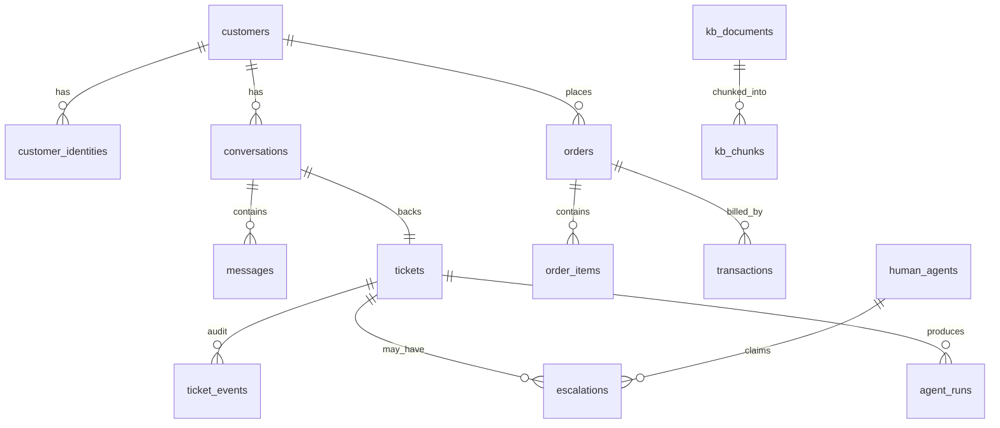

# Data Model

One PostgreSQL 18 database. **14 tables** — deliberately fewer than a production
system would have. All timestamps are `timestamptz`, all ids are `bigserial`.

## Prototype simplifications

Things a production system would separate, that are merged here on purpose:

| Production would have | This project | Why it's fine |
|---|---|---|
| `agent_steps` + `tool_calls` tables | `agent_runs.steps` JSONB array | You only ever read them together, for one run, on one screen. No cross-run queries needed. |
| `raw_events` table | `messages.raw` JSONB column | The raw payload only matters attached to its message. |
| `refunds` table | `transactions` rows with `type='refund'` | A refund *is* a transaction. One less join. |
| Agent skills, availability, routing | `human_agents` with a role only | One queue, anyone can claim anything. Skill-based routing is a paragraph in the report, not code. |
| Alembic migrations | one `schema.sql` + `make reset` | You are the only developer and the data is synthetic. Wiping and re-seeding takes 10 seconds; a migration chain takes hours over a semester. |

If a table below feels like overhead, it is on the list because a demo screen or
an eval metric reads it.



## Support core

```sql
CREATE TABLE customers (
    id         bigserial PRIMARY KEY,
    full_name  text,
    email      text UNIQUE,
    phone      text UNIQUE,
    tier       text NOT NULL DEFAULT 'standard',   -- standard | plus | priority
    verified   boolean NOT NULL DEFAULT false,
    created_at timestamptz NOT NULL DEFAULT now()
);

-- A phone number or email address is not a customer id. This is the mapping.
CREATE TABLE customer_identities (
    id          bigserial PRIMARY KEY,
    customer_id bigint NOT NULL REFERENCES customers(id) ON DELETE CASCADE,
    channel     text NOT NULL,        -- web | whatsapp | email | voice
    external_id text NOT NULL,        -- +9198..., alice@x.com, session uuid
    UNIQUE (channel, external_id)
);

CREATE TABLE conversations (
    id                 bigserial PRIMARY KEY,
    customer_id        bigint NOT NULL REFERENCES customers(id),
    channel            text NOT NULL,
    external_thread_id text NOT NULL,
    status             text NOT NULL DEFAULT 'open',   -- open | closed
    last_message_at    timestamptz NOT NULL DEFAULT now(),
    started_at         timestamptz NOT NULL DEFAULT now()
);
CREATE INDEX ON conversations (channel, external_thread_id, status);

CREATE TABLE messages (
    id                  bigserial PRIMARY KEY,
    conversation_id     bigint NOT NULL REFERENCES conversations(id) ON DELETE CASCADE,
    role                text NOT NULL,    -- customer | assistant | human_agent | system
    body                text NOT NULL,
    channel             text NOT NULL,
    direction           text NOT NULL,    -- inbound | outbound
    external_message_id text,
    raw                 jsonb,            -- provider payload, inbound only
    created_at          timestamptz NOT NULL DEFAULT now(),
    UNIQUE (channel, external_message_id)   -- the dedupe guarantee; keep this
);
CREATE INDEX ON messages (conversation_id, created_at);
```

That `UNIQUE (channel, external_message_id)` is the one constraint not to skip.
Twilio retries webhooks and IMAP re-delivers on reconnect; without it the same
customer gets answered three times, on stage, in front of an audience.

```sql
CREATE TABLE tickets (
    id                bigserial PRIMARY KEY,
    reference         text UNIQUE NOT NULL,        -- 'T-1041'
    customer_id       bigint NOT NULL REFERENCES customers(id),
    conversation_id   bigint REFERENCES conversations(id),
    channel           text NOT NULL,
    subject           text,
    intent            text,
    status            text NOT NULL DEFAULT 'new',
    priority          text NOT NULL DEFAULT 'P3',
    sentiment         text,
    ai_turns          int  NOT NULL DEFAULT 0,
    resolution        text,               -- ai_resolved | human_resolved | abandoned
    first_response_at timestamptz,
    resolved_at       timestamptz,
    created_at        timestamptz NOT NULL DEFAULT now(),
    updated_at        timestamptz NOT NULL DEFAULT now()
);
CREATE INDEX ON tickets (status, created_at);

-- Powers the ticket timeline on the dashboard. Six columns, high demo value.
CREATE TABLE ticket_events (
    id         bigserial PRIMARY KEY,
    ticket_id  bigint NOT NULL REFERENCES tickets(id) ON DELETE CASCADE,
    event_type text NOT NULL,     -- created | status_changed | escalated | reply_sent | resolved
    actor      text NOT NULL,     -- system | ai | human:<id> | customer
    payload    jsonb NOT NULL DEFAULT '{}',
    created_at timestamptz NOT NULL DEFAULT now()
);
```

**Ticket status:** `new`, `ai_working`, `awaiting_customer`, `ai_resolved`,
`escalated`, `human_working`, `closed`.

Transitions live in one function in `core/tickets.py`. Validate them — it is 20
lines and it stops the LLM inventing a status — but do not build a state-machine
library around it.

## Commerce (the business the support system serves)

```sql
CREATE TABLE orders (
    id                 bigserial PRIMARY KEY,
    order_number       text UNIQUE NOT NULL,       -- 'ORD-10432'
    customer_id        bigint NOT NULL REFERENCES customers(id),
    status             text NOT NULL,   -- placed|confirmed|shipped|in_transit|
                                        -- out_for_delivery|delivered|cancelled|returned
    total_amount       numeric(12,2) NOT NULL,
    currency           text NOT NULL DEFAULT 'INR',
    placed_at          timestamptz NOT NULL,
    promised_delivery  date,
    delivered_at       timestamptz,
    cancellable_until  timestamptz,     -- policy input, NOT an LLM judgement
    return_window_ends date,            -- policy input, NOT an LLM judgement
    -- shipment fields inlined; a separate shipments table earns nothing here
    carrier            text,
    tracking_no        text,
    tracking_status    text,
    tracking_location  text,
    eta                date
);

CREATE TABLE order_items (
    id         bigserial PRIMARY KEY,
    order_id   bigint NOT NULL REFERENCES orders(id) ON DELETE CASCADE,
    sku        text NOT NULL,
    name       text NOT NULL,
    qty        int NOT NULL,
    unit_price numeric(12,2) NOT NULL,
    returnable boolean NOT NULL DEFAULT true
);

CREATE TABLE transactions (
    id           bigserial PRIMARY KEY,
    txn_ref      text UNIQUE NOT NULL,             -- 'TXN-88213'
    order_id     bigint REFERENCES orders(id),
    customer_id  bigint NOT NULL REFERENCES customers(id),
    type         text NOT NULL,   -- payment | refund
    method       text NOT NULL,   -- card | upi | netbanking | cod
    amount       numeric(12,2) NOT NULL,
    status       text NOT NULL,   -- pending | captured | failed |
                                  -- refund_initiated | refunded
    failure_code text,
    -- refund-specific, null on payments
    refund_reason      text,
    refund_ticket_id   bigint REFERENCES tickets(id),
    refund_approved_by bigint REFERENCES human_agents(id),
    expected_credit_by date,
    created_at   timestamptz NOT NULL,
    settled_at   timestamptz
);
```

`cancellable_until`, `return_window_ends` and `order_items.returnable` are the
most valuable columns in the schema. Eligibility gets **read**, never inferred by
the model. That single choice removes most of the hallucination risk for
approximately zero effort.

## Knowledge base

```sql
CREATE EXTENSION IF NOT EXISTS vector;

CREATE TABLE kb_documents (
    id         bigserial PRIMARY KEY,
    title      text NOT NULL,
    category   text,             -- shipping | refunds | payments | account | product
    body       text NOT NULL,    -- markdown
    is_active  boolean NOT NULL DEFAULT true,
    updated_at timestamptz NOT NULL DEFAULT now()
);

CREATE TABLE kb_chunks (
    id           bigserial PRIMARY KEY,
    document_id  bigint NOT NULL REFERENCES kb_documents(id) ON DELETE CASCADE,
    heading_path text,                    -- 'Refunds > Timelines'
    content      text NOT NULL,
    embedding    vector(384) NOT NULL,    -- bge-small-en-v1.5
    tsv          tsvector GENERATED ALWAYS AS (to_tsvector('english', content)) STORED
);
CREATE INDEX kb_chunks_vec_idx ON kb_chunks USING hnsw (embedding vector_cosine_ops);
CREATE INDEX kb_chunks_tsv_idx ON kb_chunks USING gin (tsv);
```

Both indexes are needed: dense search finds paraphrases, `tsvector` finds order
numbers, SKUs and error codes, which dense embeddings are reliably bad at.

## Humans and escalation

```sql
CREATE TABLE human_agents (
    id            bigserial PRIMARY KEY,
    email         text UNIQUE NOT NULL,
    full_name     text NOT NULL,
    password_hash text NOT NULL,
    role          text NOT NULL DEFAULT 'agent'   -- agent | admin
);

CREATE TABLE escalations (
    id             bigserial PRIMARY KEY,
    ticket_id      bigint NOT NULL REFERENCES tickets(id) ON DELETE CASCADE,
    reason_code    text NOT NULL,
    reason_detail  text,
    priority       text NOT NULL,
    handoff_packet jsonb NOT NULL,     -- summary, timeline, entities, draft
    status         text NOT NULL DEFAULT 'queued',  -- queued|claimed|resolved|returned_to_ai
    claimed_by     bigint REFERENCES human_agents(id),
    human_note     text,
    created_at     timestamptz NOT NULL DEFAULT now(),
    resolved_at    timestamptz
);
CREATE INDEX ON escalations (status, priority, created_at);
```

Claiming still uses `SELECT ... FOR UPDATE SKIP LOCKED` — it is one clause and it
is the difference between a working queue and a race you will waste an evening on.

## Agent traces

```sql
CREATE TABLE agent_runs (
    id           bigserial PRIMARY KEY,
    ticket_id    bigint REFERENCES tickets(id) ON DELETE CASCADE,
    message_id   bigint REFERENCES messages(id),
    trigger      text NOT NULL,      -- inbound_message | resume
    outcome      text,               -- answered | escalated | failed
    intent       text,
    confidence   numeric(4,3),
    steps        jsonb NOT NULL DEFAULT '[]',   -- [{node, model, output, tool_calls,
                                                --   tokens_in, tokens_out, ms, error}]
    tokens_in    int NOT NULL DEFAULT 0,
    tokens_out   int NOT NULL DEFAULT 0,
    latency_ms   int,
    error        text,
    created_at   timestamptz NOT NULL DEFAULT now()
);
```

One row per inbound message, with the whole reasoning trace in `steps`. This is
what the "why did the AI do that" screen renders and what the eval harness reads.
Do not skip it — it is the single highest-value-per-line table in the project.

LangGraph's checkpointer creates its own tables (`checkpoints`,
`checkpoint_writes`) via `.setup()`. Leave them alone.

## Schema management

No Alembic. `backend/schema.sql` holds the statements above; `make reset` drops
the database, recreates it, and re-seeds. Schema changes mean editing one file
and running one command.

The moment this stops being true — if you ever have data worth keeping — switch
to Alembic. For synthetic seed data on a prototype, you will not.

## Seed data

`app/seed/` generates a fixed-seed synthetic dataset so demos are reproducible:

- 60 customers across 3 tiers, with WhatsApp and email identities.
- 200 orders over 6 months. **Write the 30 edge cases first**, then pad with
  boring ones: delivered but reported missing, stuck past ETA, cancelled after
  shipping, duplicate charge, partial return, COD refund, out-of-window return.
- 300 transactions including 20 failures with codes and 15 refunds mid-flight.
- 25 knowledge-base documents — and leave 5 common questions **deliberately
  unanswered**, so there is something for the system to correctly refuse.
- 3 human agents.

Smaller than the first draft on purpose. 200 orders demo exactly as well as 800
and seed in a fraction of the time. The edge cases are what matter; the volume is
not.
