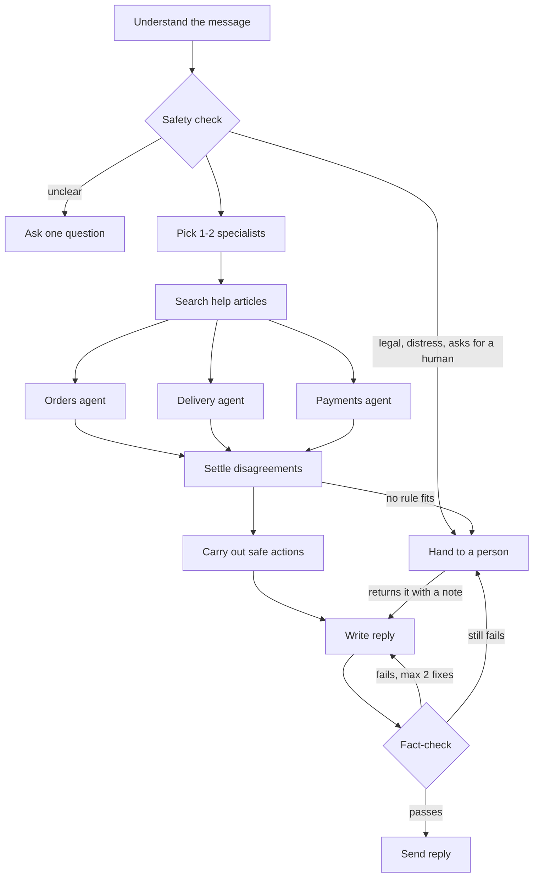

# How the AI agents work

This is the core of the project: which agents exist, what each one does, who can
talk to whom, and how disagreements are settled. For how messages get in and
out, see [`architecture-overview.md`](architecture-overview.md).

## Four rules

1. **Split by area of work, not by channel.** There is an orders agent, a
   delivery agent and a payments agent. There is no "WhatsApp agent".
2. **Agents propose, code decides.** An agent can ask to cancel an order or
   refund a payment. Plain Python checks the rules, settles disagreements and
   carries out the action.
3. **Facts come from data.** Whether a return window is open, or a refund is
   allowed, is read from the database. The AI never judges it.
4. **Nothing reaches a customer unchecked.** Every reply is fact-checked first.

## The flow

Only one or two of the three specialists run for a message, never all three.
They run at the same time.

## Every agent, and what it does

Some steps use an AI model, some are plain code on purpose. Code is used
wherever a wrong guess would be costly.

| Step | Code name | AI? | What it does |
|---|---|---|---|
| Understand | `prepare`, `classify` | yes | Loads the last 10 messages. Picks what the customer wants from a fixed list of 19 intents (e.g. `order_cancel`, `refund_request`), how sure it is, and a second intent if the message asks for two things. |
| Safety check | `hard_route` | no | Sends legal threats, signs of distress and "let me talk to a human" straight to a person. If the AI is unsure (confidence below 0.6), it asks the customer one question instead. |
| Pick specialists | `supervisor` | no | A fixed table maps each intent to its specialist. No AI guessing, so it is always clear who handled what. |
| Search help articles | `retrieve` | no | Finds relevant policy text by meaning and by keyword, then reranks. Plain policy questions are answered from this alone. |
| Orders agent | `specialist` | yes | Cancel, change or return an order. |
| Delivery agent | `specialist` | yes | Where is my parcel, late, damaged or missing. |
| Payments agent | `specialist` | yes | Refunds, failed payments, invoices, billing disputes. |
| Settle disagreements | `reconcile` | no | Looks at all specialists' findings and proposals together and applies the conflict rules below. |
| Carry out actions | `commit` | no | Does the proposals that survived, checking every rule again on fresh data first. |
| Write reply | `answer` | yes | Writes the reply using only the data found and the help articles, with citations. Also writes clarifying questions. |
| Fact-check | `verify` | yes | A second AI pass: is every claim backed by the data, does it answer the question, is it within policy? If not, the reply is rewritten (up to 2 times). |
| Send | `respond` | no | Saves and sends the reply, updates the ticket, and records tokens and cost. |
| Hand off | `escalate` | summary only | Builds the handoff packet for a person, tells the customer, and pauses. |

## The three specialists

Each specialist has its own instructions (`prompts/specialist_*.md`) and its own
set of tools. It cannot call a tool outside its set.

| Specialist | Handles | Tools it can use |
|---|---|---|
| **Orders** | cancel, change, return | look up orders, check if cancellable, **cancel**, check if returnable, **start a return** |
| **Delivery** | where is it, late, damaged, missing | look up orders, track shipment, **open a carrier investigation**, check if returnable, **start a return** |
| **Payments** | refund status, refund request, failed payment, invoice, billing dispute | look up payments, refund status, explain a failed payment, **request a refund**, make an invoice |

Bold tools change something. The table lives in `backend/app/agent/specialists.py`.

**How a specialist works:** it gets the conversation and its tools, then loops:
the AI picks a tool, the tool runs, the result goes back to the AI. It stops when
the AI has what it needs or runs out of budget. The whole message gets **5 tool
calls**, shared between specialists (5 for one, 3 + 2 for two).

When a specialist calls a tool that changes something, the tool checks all the
rules as normal but **does not do it**. It returns "this would be done" and the
specialist moves on. Only the `commit` step makes real changes.

If the AI calls a tool that doesn't exist, or passes bad arguments, it gets a
clear error back (which field was wrong, what was expected) and can try again.

## Who can talk to whom

- **Specialists never talk to each other.** They work side by side and each
  hands in one report: what it looked up, what it proposes, and a short note.
- **Specialists can look things up, but cannot change anything.** Only
  `commit` changes data.
- **Tools only see the current customer.** The customer id comes from the
  ticket, never from what the AI typed. "Show me order ORD-99999" for someone
  else's order simply finds nothing.
- **Rules are checked twice** for every change: when proposed and again just
  before it is done.
- **The reply writer and fact-checker** see everything the specialists found,
  plus any conflict notes, but cannot call tools.
- **People** reach the agents only through the console: approve or reject a
  refund, reply directly, or hand the ticket back to the AI with a note.

## How disagreements are settled

Two specialists working on one message can disagree. Because they only
proposed, nothing has happened yet, so the disagreement can be settled cleanly.
The rules are plain code in `backend/app/policy/conflicts.py`. When two are
equal, the specialist for the customer's main request wins.

**The data disagrees.** The order record says "delivered", the carrier says "in
transit". The carrier wins: it knows where the parcel really is. Any action on
that order waits for now, because it was planned on the wrong story. The reply
tells the customer what the carrier shows.

**Both propose the same thing.** Orders and delivery both propose a return for
the same item. It is done once.

**The actions clash.** Some actions can't both happen on one order:

| Kept | Dropped | Why |
|---|---|---|
| Cancel | Return | Not shipped yet, so cancel |
| Cancel | Refund | Cancelling refunds in full already |
| Carrier investigation | Refund | The investigation ends in a replacement or refund |
| Carrier investigation | Return | You can't return a parcel that never arrived |
| Return | Refund | The refund follows once the item is back |

The reply explains what was dropped and why, using wording from the help
articles so the fact-check can confirm it.

**Refunds that add up too high.** Two refunds, each under the limit (1000) but
over it together. Both go ahead, through the approval queue.

**No rule fits.** Two different changes on one order that no rule covers.
Nothing is done, and the ticket goes to a person with both proposals. With
today's tools this can't happen; it guards against tools added later.

Every disagreement is recorded with the rule used, what was kept and what was
dropped. It shows up in the ticket's reasoning trace in the admin console.

## When a person takes over

The AI tries not to hand off without need:

- **Unclear message, or nothing found:** ask one clear question. Hand off only
  after 2 in a row.
- **Refund it may not approve** (over 1000, or no matching failed or double
  charge): put it in the **approval queue**. A person approves or rejects it in
  one click; the AI keeps the conversation.
- **Lost or late parcel:** open a carrier investigation, but only after the
  waiting time in the data has passed (24 hours after "delivered", or more
  than 3 days late).

It always hands off for: asking for a human, distress, legal or chargeback
language, 4 AI turns without a fix, a reply that fails the fact-check twice,
no answer after 2 questions, or a disagreement no rule fits.

**The handoff packet** has a short AI-written summary. Everything else is taken
straight from the data, so a person can trust it: customer details, what the AI
looked up and found, any disagreements, order numbers and amounts, and the
unsent draft as a suggested reply.

**Pause and resume.** The agent pauses mid-run (LangGraph `interrupt()`) with its
full state saved in Postgres. If the person hands it back with a note, the agent
continues from that point and writes the reply using the note.

## Limits

| Limit | Value |
|---|---|
| Tool calls per message (all specialists together) | 5 |
| Specialists per message | 2 |
| AI turns per ticket before handing off | 4 |
| Fact-check rewrites | 2 |
| Clarifying questions in a row | 2 |
| Refund the AI can approve alone | 1000 |

All are settings in `backend/app/config.py`.

## One message, start to finish

> "Where is ORD-10200? It says delivered but I don't have it. Also refund
> the double charge on my earlier order."

1. **Understand:** main request `delivery_issue`, second `refund_request`.
2. **Pick:** delivery agent (3 tool calls) and payments agent (2).
3. **Search:** finds the "delivered but not received" and refund articles.
4. **At the same time:**
   - Delivery looks up the order ("delivered") and tracks the parcel ("in
     transit").
   - Payments finds the double charge and proposes a refund.
5. **Settle:** the data disagrees on ORD-10200, so the carrier wins and nothing
   is done on that order this turn. The refund is on a different order, so it
   goes ahead.
6. **Carry out:** the refund is checked again and approved (under 1000, real
   double charge).
7. **Write and fact-check:** "The carrier shows your parcel is still in
   transit... the refund for the double charge is approved..." Passes.
8. **Send.**

## Where to look in the code

| What | File |
|---|---|
| The flow | `backend/app/agent/graph.py` |
| Specialists, their tools and budgets | `backend/app/agent/specialists.py` |
| Each step | `backend/app/agent/nodes/` |
| AI instructions | `backend/app/agent/prompts/` |
| Conflict rules | `backend/app/policy/conflicts.py` |
| Allow / needs a person / deny | `backend/app/policy/authorize.py` |
| Tools | `backend/app/tools/` |
| Handoff packet | `backend/app/agent/escalation.py` |
