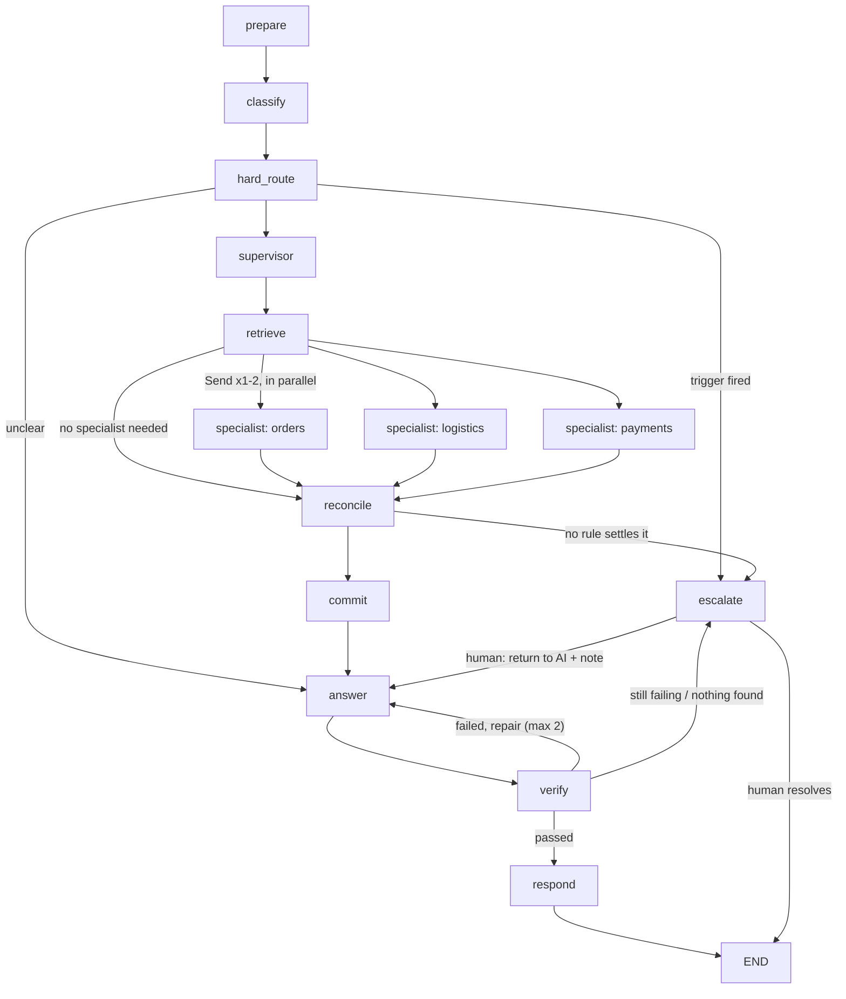

# How the agent system works

A guide for someone who has never seen this project. It covers the core: which
agents exist, what each one does and how, who can talk to whom, and how
disagreements are settled. For the full blueprint see `04-agent-design.md` and
`05-escalation-policy.md`. For the reasons behind the specialist split see
`decisions/0006-specialist-agents.md` and `decisions/0007-fewer-handoffs.md`.

## The idea in four rules

1. **One brain, many channels.** Web chat, WhatsApp, email and voice notes all
   feed the same agent graph. Channel code only translates messages in and out.
   It has no AI in it.
2. **Agents split by domain, not by channel.** There is an orders agent, a
   logistics agent and a payments agent. There is no "WhatsApp agent".
3. **The AI proposes, code decides.** A model can ask to cancel an order or
   refund a payment. Plain Python checks eligibility and limits, settles
   disagreements, and carries out the action. No prompt can get past that.
4. **A good handoff is a valid outcome.** When the AI can't or shouldn't finish,
   a human gets a full case file and can hand the ticket back.

## How a message reaches the agent

```
channel webhook / websocket
  -> save raw event, dedupe on (channel, external_message_id), PII redaction
  -> enqueue an arq job, return 200 right away (no LLM call in the request)
  -> worker: run_agent(ticket) -> LangGraph graph, thread id "ticket:{id}"
```

Before the graph starts, the worker sets the **trusted state**: `ticket_id`,
`customer_id`, `conversation_id`, `channel`. No node ever writes these from
model output. Every tool reads `customer_id` from here, so "show me order
ORD-99999" from a different customer finds nothing.

The graph is checkpointed in Postgres per ticket. That is what lets it pause
for a human and pick up again later.

## The graph



At most two of the three specialists run for one message.

## The agents and what each one does

"Agent" here means a step in the graph with one clear job. Some call an LLM,
some are plain code on purpose. The table says which.

| Agent (node) | LLM? | Job | How |
|---|---|---|---|
| `prepare` | no | Load context | Last 10 messages (the redacted version of customer text) and the ticket's `ai_turns` count. |
| `classify` | yes (`classify` role) | Work out what the customer wants | Structured output: `intent` from a fixed list of 19, `confidence`, and an optional `secondary_intent` when one message asks for two things. |
| `hard_route` | no | Catch cases that must not be automated | Keyword triggers (asked for a human, legal/chargeback, self-harm), `MAX_AI_TURNS`, and low confidence. Low confidence means ask a question first, not hand off. |
| `supervisor` | no | Pick who works the message | A table lookup from intent to specialist. Splits the tool budget. Deterministic, so ownership is always explainable. |
| `retrieve` ("knowledge") | no | Find help-article context | Hybrid search: pgvector dense + Postgres full-text, merged, then a flashrank reranker. Runs for every message except chitchat/spam. |
| `specialist: orders` | yes (`reason`) | Cancel, modify, return | Bounded tool loop over its own tools only. Proposes writes, never does them. |
| `specialist: logistics` | yes (`reason`) | Where is my parcel, late, damaged, missing | Same loop. Can propose a carrier investigation or a return. |
| `specialist: payments` | yes (`reason`) | Refunds, failed payments, invoices, billing disputes | Same loop. Can propose a refund. |
| `reconcile` | no | Settle disagreements between specialists | A rule table in `policy/conflicts.py`. Decides which proposals survive. |
| `commit` | no | Carry out the surviving proposals | Re-runs each write tool for real, which runs `authorize()` a second time on fresh data. |
| `answer` | yes (`reason`) | Write the reply | Grounded only in retrieved chunks and tool results, with `[n]` citations. Also writes clarifying questions and short chitchat replies. |
| `verify` | yes (`verify`) | Check the reply before the customer sees it | Structured verdict: `grounded`, `answers_question`, `policy_safe`. Fails go back to `answer` with feedback, up to 2 times. |
| `respond` | no | Send it | Saves the message, moves the ticket state, totals tokens and cost for the run, sends through the channel adapter. |
| `escalate` | yes (`summarize`, for the summary only) | Hand off to a human | Builds the handoff packet, acknowledges the customer, then pauses the graph with `interrupt()`. |

LLM roles map to model ids in `.env` only (`MODEL_CLASSIFY`, `MODEL_REASON`,
`MODEL_VERIFY`, `MODEL_SUMMARIZE`), read through `app/llm/registry.py`, with a
fallback provider if the main one fails. `LLM_PROVIDER=stub` runs everything
offline.

## The three specialists

Defined in one table, `app/agent/specialists.py`.

| Specialist | Owns these intents | Tools it can call |
|---|---|---|
| orders | `order_cancel`, `order_modify`, `order_return` | `list_recent_orders`, `get_order`, `check_cancellation_eligibility`, **`request_cancellation`**, `check_return_eligibility`, **`initiate_return`** |
| logistics | `order_status`, `delivery_issue`, `damaged_or_missing_item` | `list_recent_orders`, `get_order`, `track_shipment`, **`open_carrier_investigation`**, `check_return_eligibility`, **`initiate_return`** |
| payments | `refund_status`, `refund_request`, `payment_failed`, `invoice_request`, `billing_dispute` | `list_recent_orders`, `list_transactions_for_order`, `get_transaction`, `get_refund_status`, `explain_payment_failure`, **`request_refund`**, `generate_invoice` |

Bold tools are writes. Knowledge questions (`product_question`,
`policy_question`, `account_issue`, `complaint`) have no specialist. The
`retrieve` step handles them alone.

**How one specialist runs** (`app/agent/nodes/specialist.py`):

1. Gets its own prompt (`prompts/specialist_<name>.md`), the conversation, and
   only its own tools bound to the model.
2. Loops: the model picks tool calls, each one runs through `execute_tool`, the
   result goes back to the model. The loop stops when the model stops asking
   for tools or the budget runs out.
3. The budget is a share of `MAX_TOOL_CALLS = 5` for the whole turn: one
   specialist gets 5, two get 3 and 2.
4. Write tools run with `propose_only=True`. They check eligibility and
   `authorize()` as normal, then return what they *would* do. The model is told
   the action is queued, so it does not retry it.
5. Returns one report: reads it made, proposals, and a short note.

A model calling a tool outside its list gets an `unknown_tool` error back, not
a crash. Bad arguments get an `invalid_arguments` error naming the field and
the schema, so the model can fix the call on the next round.

## Who can talk to whom

- **Specialists never talk to each other.** They run in parallel (LangGraph
  `Send`), each in its own branch, and do not see each other's work. Their
  reports are collected by a reducer on `specialist_reports` and handed to
  `reconcile` together.
- **Specialists can read, not write.** Every read is real. Every write is a
  proposal. Only `commit` changes data.
- **Tools see only one customer.** Every query is scoped by
  `ToolContext.customer_id` from trusted state. Model arguments can name any
  order; the tool only finds the customer's own.
- **Eligibility comes from data.** `orders.cancellable_until`,
  `orders.return_window_ends`, `order_items.returnable`, shipment timestamps.
  The model never decides whether a window is open.
- **`authorize()` runs twice for writes**: once when proposed, once in
  `commit`. Nothing is trusted because it looked fine a moment earlier.
- **Parallel branches share one DB session**, guarded by a lock, so their
  `agent_steps` and `tool_calls` rows do not collide.
- **`answer` and `verify` see everything** the specialists and `reconcile`
  produced (tool results, conflict notes, skipped actions with reasons), but
  call no tools.
- **Humans** reach the graph only through the console: approve or reject a
  refund, reply directly, resolve, or return the ticket to the AI with a note.

## How conflicts are settled

When two specialists work one message, they can disagree. Because they only
proposed, nothing has changed yet, so a conflict is something to settle, not
something already done twice. `reconcile` runs pure functions over plain dicts
(`app/policy/conflicts.py`, unit-tested in `tests/test_conflicts.py`). Ties go
to the specialist that owns the primary intent.

**1. Fact conflict:** two sources disagree about the same order. Example: the
order record says `delivered`, the carrier says `in_transit`.

- Rule `carrier_is_truth_for_parcel`: the carrier's scan is the truth about
  where the parcel is.
- Every write on that order is held for this turn (it was planned on the wrong
  story).
- The reply is told which fact to use.

**2. Duplicate:** two specialists propose the same action on the same target
(both orders and logistics propose a return of one item).

- Rule `same_action_once`: the first one is kept.

**3. Action conflict:** different actions on one order that can't all happen.

| Kept | Dropped | Rule | Why |
|---|---|---|---|
| cancel | return | `cancel_over_return` | Not shipped yet, so cancel |
| cancel | refund | `cancel_covers_refund` | Cancelling refunds in full already |
| carrier investigation | refund | `investigation_before_refund` | Investigation ends in a replacement or refund |
| carrier investigation | return | `investigation_before_return` | Can't return what never arrived |
| return | refund | `return_covers_refund` | Refund follows once the item is back |

Each dropped action becomes a note the reply can use, worded from the
knowledge base so `verify` can check it.

**4. Combined refunds over the ceiling:** two refunds, each under
`AUTO_REFUND_CEILING` alone, but over it together.

- Rule `combined_refund_over_ceiling`: both go ahead, but both are sent to the
  human approval queue.

**Last resort:** two different writes on one order that no rule covers. Then
nothing is committed, and the ticket escalates with reason `agent_conflict`
and both proposals in the packet. With today's tools this can't happen. It
guards tools added later.

Every conflict is saved in the `reconcile` step with its kind, the agents
involved, the rule, what was kept and what was dropped. The ticket trace and
`/admin/metrics/agents` read it back.

## Checking the answer

`verify` is a second LLM call that grades the draft against the same context
`answer` saw. It checks three things: the reply is grounded in the context, it
answers what was asked, and it is policy-safe. If any check fails, `answer`
rewrites with the verdict as feedback, up to 2 times. After that the ticket
escalates (`ungrounded_answer`). Clarifying questions skip `verify`; they state
no facts.

## When a human takes over

The AI tries hard not to hand off without need (`decisions/0007-fewer-handoffs.md`):

- **Unclear message, or nothing found:** ask one specific question. Escalate
  only after 2 questions in a row.
- **Refund the AI can't approve** (over the ceiling, or no matching failed or
  duplicate charge): saved as `refunds.status = 'requested'`. A human approves
  or rejects it in one click under Console → Approvals. The AI keeps the
  conversation.
- **Lost or late parcel:** `open_carrier_investigation`, allowed only after the
  wait times in the data (24 hours after a delivery scan, or more than 3 days
  past the promised date).

It always escalates on: an explicit request for a human, self-harm or abuse,
legal or chargeback language, `MAX_AI_TURNS = 4` reached, a draft failing
`verify` after 2 repairs, nothing to answer from after 2 questions, or an
`agent_conflict`.

**What escalation does** (`app/agent/nodes/escalate.py`):

1. Builds a **handoff packet**. Only the summary is written by an LLM.
   Everything else comes straight from state: customer, intent, confidence,
   timeline of tool calls and their results, conflicts found, entities
   (order number, transaction, amount), and the unsent draft as a suggested
   reply.
2. Creates an `escalations` row, moves the ticket to `escalated`, and tells
   the customer a reference number.
3. Pauses the graph with LangGraph `interrupt()`. The state stays in the
   Postgres checkpoint.

**Coming back:** in the console, a human can reply directly and resolve, or
choose **return to AI** with a note. That resumes the same thread
(`Command(resume=...)`), and the graph goes to `answer` with the human's note
added to the prompt. It reuses the context it already has and makes no new tool
calls.

Resume re-runs `escalate_node` from the top (that is how LangGraph replays
interrupts). A guard looks for an open escalation first, so no second row or
ticket transition is created.

## Safety limits

| Limit | Value | Where |
|---|---|---|
| Tool calls per turn, all specialists together | 5 | `MAX_TOOL_CALLS` |
| AI turns per ticket before handoff | 4 | `MAX_AI_TURNS` |
| Specialists per message | 2 | `MAX_SPECIALISTS_PER_TURN` |
| Verify repairs | 2 | `MAX_VERIFY_REPAIRS` |
| Clarifying questions in a row | 2 | `MAX_CLARIFICATIONS` |
| Minimum intent confidence | 0.60 | `INTENT_CONFIDENCE_MIN` |
| Refund the AI can approve alone | 1000.00 | `AUTO_REFUND_CEILING` |

## Everything is recorded

Every run writes `agent_runs` (one per message), `agent_steps` (one per node,
tagged with the agent name, model, tokens, latency, and output) and
`tool_calls` (arguments, result, whether it was authorized, and why not). That
powers the "why did the AI do that" trace in the admin UI, the per-agent
metrics, and most of the eval harness. Langfuse tracing is optional on top.

## One message, end to end

> "Where is ORD-10200? It says delivered but I don't have it. Also refund
> the duplicate charge on my earlier order."

1. `classify`: `delivery_issue` (primary), `refund_request` (secondary).
2. `supervisor`: logistics first, payments second. Budgets 3 and 2.
3. `retrieve`: finds the "delivered but not received" and refund policy
   articles.
4. In parallel:
   - logistics calls `get_order` (says `delivered`), then `track_shipment`
     (says `in_transit`).
   - payments finds the duplicate charge and proposes `request_refund`.
5. `reconcile`: fact conflict on ORD-10200, so the carrier wins. Writes on
   that order are held this turn. The refund is on a different order, so it
   passes. (Had it been on ORD-10200, it would have been held too.)
6. `commit`: runs the refund for real. `authorize()` approves it, since it is
   under the ceiling and matches a duplicate.
7. `answer`: "The carrier shows it still in transit ... the refund for the
   duplicate charge is approved, expect it by ..." with citations.
8. `verify` passes. `respond` sends it.

## Where to look in the code

| What | File |
|---|---|
| Graph wiring | `backend/app/agent/graph.py` |
| State and the report reducer | `backend/app/agent/state.py` |
| Specialist table, routing, budgets | `backend/app/agent/specialists.py` |
| Nodes, one file each | `backend/app/agent/nodes/` |
| Prompts | `backend/app/agent/prompts/` |
| Conflict rules | `backend/app/policy/conflicts.py` |
| Authorization | `backend/app/policy/authorize.py` |
| Hard triggers | `backend/app/policy/triggers.py` |
| Tools and the wrapper | `backend/app/tools/` (`registry.py` for `execute_tool`) |
| Handoff packet | `backend/app/agent/escalation.py` |
| Run and resume | `backend/app/agent/run.py` |
| Console (approvals, return to AI) | `backend/app/api/console.py` |
