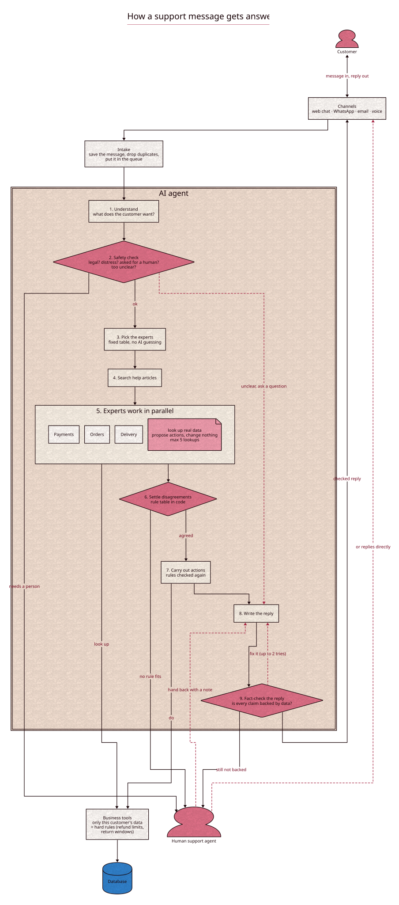

# Architecture overview

How the whole system fits together, in five minutes. For the AI agents
themselves (who does what, how they disagree), read
[`agent-orchestration.md`](agent-orchestration.md).

## The big idea

A customer writes in on any channel. An AI agent tries to fix the problem using
real order, payment and delivery data. If it can't or shouldn't, it hands the
ticket to a person with everything they need, and the person can hand it back.

Three rules shape everything:

1. **One brain, many channels.** Web chat, WhatsApp, email and voice notes all
   feed the same AI agent. Channels only translate messages in and out.
2. **The AI suggests, the code decides.** The AI can ask for a refund. Plain
   code checks the limits and approves it or not.
3. **Handing off to a person is a valid outcome**, not a failure.

## The journey of one message

**1. Channel.** The customer writes on web chat, WhatsApp, email, or sends a
voice note. Each channel turns its own format into one standard message.
Voice notes become text first.

**2. Intake.** No AI here, just three quick jobs:

- Save the raw message at once, so a crash never loses it.
- Drop duplicates. Twilio retries and email can arrive twice. A database rule
  (`UNIQUE (channel, external_message_id)`) makes sure the customer is answered
  once.
- Put the message on a queue (Redis + `arq`) and say "got it" to the provider.

Intake also works out who the customer is and which ticket the message belongs
to, and hides personal details (phone numbers, card numbers, names) before any
text reaches the AI.

**3. Worker.** A separate process takes the message off the queue and runs the
AI agent, so a slow AI call never holds up a webhook.

**4. AI agent.** A LangGraph state machine: a fixed set of steps with clear
rules about what comes next. In short:

- understand the message, and stop early for anything a person must handle,
- pick one or two specialist agents (orders, delivery, payments),
- they look up real data at the same time and *propose* actions,
- code settles any disagreement and carries out the safe actions,
- write the reply, fact-check it, and send it.

Full detail in [`agent-orchestration.md`](agent-orchestration.md).

**5. Reply.** The answer goes back on the channel the customer used, in that
channel's style (short and plain for WhatsApp and voice).

## When a person steps in

- **Approvals.** A refund the AI may not approve alone waits in an approval
  queue. A person approves or rejects it in one click. The AI keeps the
  conversation.
- **Handoffs.** For legal threats, distress, "let me talk to a human", or when
  the AI is stuck, the ticket goes to the console with a handoff packet:
  summary, customer data, what the AI tried, and a suggested reply. The agent
  pauses and saves its state.
- **Handing back.** The person can reply directly, or return the ticket to the
  AI with a note ("refund approved, let them know"). The agent picks up where it
  paused.

## What keeps it safe

- Tools only ever see the current customer's data. The customer id comes from
  the ticket, never from what the AI typed.
- Whether an order can still be cancelled or returned comes from stored dates
  and flags, never from the AI's judgement.
- Every action goes through `authorize()` in code: allow, needs a person, or
  deny.
- Hard limits stop runaway loops: 5 tool calls per message, 4 AI turns per
  ticket.
- AI model names live only in `.env`. Gemini is used first, Groq if it fails.

## What gets recorded

Every run, step and tool call is saved (`agent_runs`, `agent_steps`,
`tool_calls`) with timings, tokens and cost. That powers the "why did the AI do
that?" screen in the admin console and the evaluation harness. Langfuse
(`make langfuse`) can show the same runs with every prompt and response.

## The apps

| App | Who uses it | What it does |
|---|---|---|
| Web chat | Customers | Chat, with live progress ("Searching our help articles...") |
| Console | Support staff | Queue of handoffs, approvals, reply or return to AI |
| Admin | Team leads | Ticket list with the AI's reasoning trace, metrics, help-article editor |

## Tech in one line each

- **Backend:** Python 3.13, FastAPI, LangGraph, SQLAlchemy (async), Alembic.
- **Data:** PostgreSQL 18 with pgvector, Redis.
- **Search:** pgvector + Postgres full-text, then a flashrank reranker.
- **Frontend:** Vite, React, TanStack Router and Query.
- **Processes:** `api` and `worker` (the worker also runs the email poll cron). One Postgres, one Redis.

## Where to look in the code

| Part | Location |
|---|---|
| Channels | `backend/app/channels/` |
| Intake | `backend/app/ingress/`, `backend/app/core/` |
| Queue and worker | `backend/app/workers/` |
| AI agent | `backend/app/agent/` |
| Business tools | `backend/app/tools/` |
| Rules (`authorize()`, conflicts, safety triggers) | `backend/app/policy/` |
| Frontend | `frontend/src/` |
